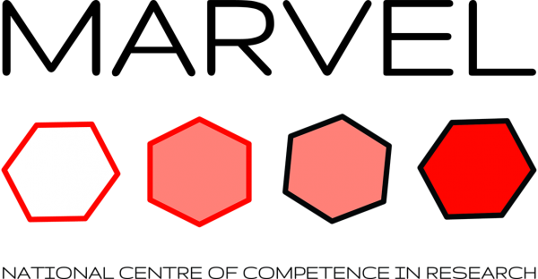

# AiiDA Atomistic

An AiiDA plugin package providing data classes for atomistic simulations.
Create, manipulate, and store atomic structures with property support: magnetic moments, charges, Hubbard parameters and more.
Specifically developed for DFT calculations, molecular dynamics, and high-throughput materials discovery.

______________________________________________________________________

-   **Getting Started**

    ---

    Quick start guide to install and use `aiida-atomistic`.

    [To the quick start guide](installation_quickstart/quickstart.md)

-   **Tutorials**

    ---

    Easy examples to take the first steps with the enhanced `StructureData`.

    [To the tutorials](tutorials/index.md)

-   **How-To Guides**

    ---

    Step-by-step guides for common tasks and workflows.

    [To the how-to guides](how_to/index.md)

-   **In-Depth Guides**

    ---

    In-depth explanations of concepts, implementation and advanced topics.

    [To the in-depth guides](in_depth/index.md)

## How to cite

If you use this plugin for your research, please cite the following work:

> Sebastiaan. P. Huber, Spyros Zoupanos, Martin Uhrin, Leopold Talirz, Leonid Kahle, Rico Häuselmann, Dominik Gresch, Tiziano Müller, Aliaksandr V. Yakutovich, Casper W. Andersen, Francisco F. Ramirez, Carl S. Adorf, Fernando Gargiulo, Snehal Kumbhar, Elsa Passaro, Conrad Johnston, Andrius Merkys, Andrea Cepellotti, Nicolas Mounet, Nicola Marzari, Boris Kozinsky, and Giovanni Pizzi, [*AiiDA 1.0, a scalable computational infrastructure for automated reproducible workflows and data provenance*](https://doi.org/10.1038/s41597-020-00638-4), Scientific Data **7**, 300 (2020)

> Martin Uhrin, Sebastiaan. P. Huber, Jusong Yu, Nicola Marzari, and Giovanni Pizzi, [*Workflows in AiiDA: Engineering a high-throughput, event-based engine for robust and modular computational workflows*](https://doi.org/10.1016/j.commatsci.2020.110086), Computational Materials Science **187**, 110086 (2021)

## Acknowledgements

We acknowledge support from the [NCCR MARVEL](http://nccr-marvel.ch/) funded by the Swiss National Science Foundation and the EU Centre of Excellence ["MaX – Materials Design at the Exascale"](http://www.max-centre.eu/) (Horizon 2020 EINFRA-5, Grant No. 676598). 

{ width="250" }
{ width="300" } 

[aiida]: http://aiida.net
[aiida-core documentation]: https://aiida.readthedocs.io/projects/aiida-core/en/latest/intro/get_started.html
[aiida-atomistic]: https://github.com/aiidateam/aiida-atomistic
